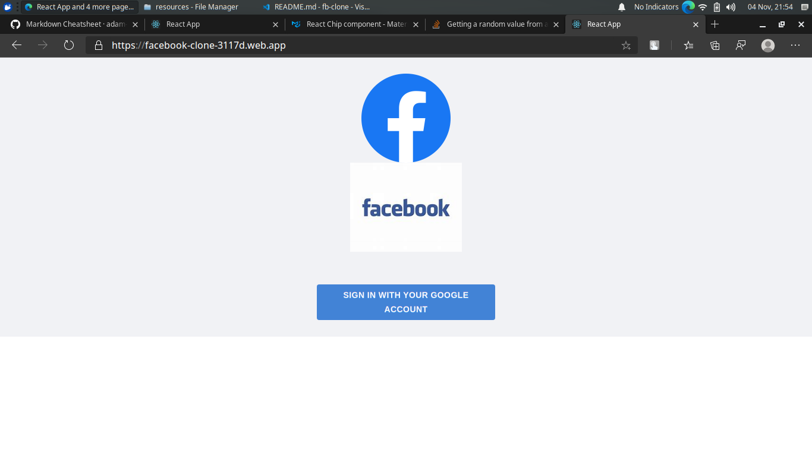
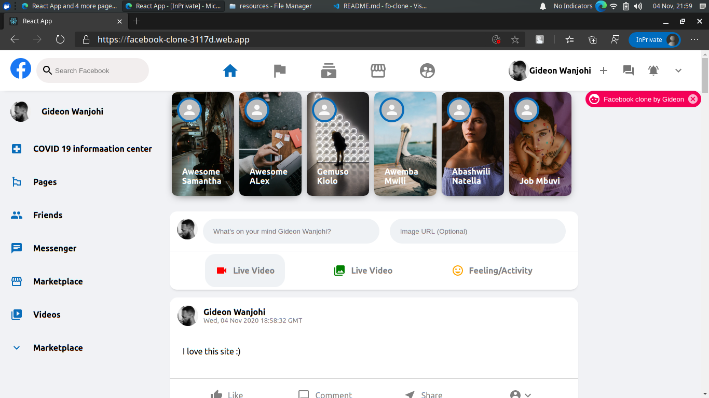

## A FACEBOOK CLONE IN JAVASCRIPT REACT AND FIREBASE

* The project emulates the new Facebook website using Facebook's own React framework 

## Available Scripts

In the project directory, you can run:

### `npm start`
### `npm test`
### `npm run build`
### `npm run eject`

### SCREENSHOTS

Here's a link to the deployed site: [Click Here] (https://facebook-clone-3117d.web.app/)
You can extend it further. Happy coding :)
